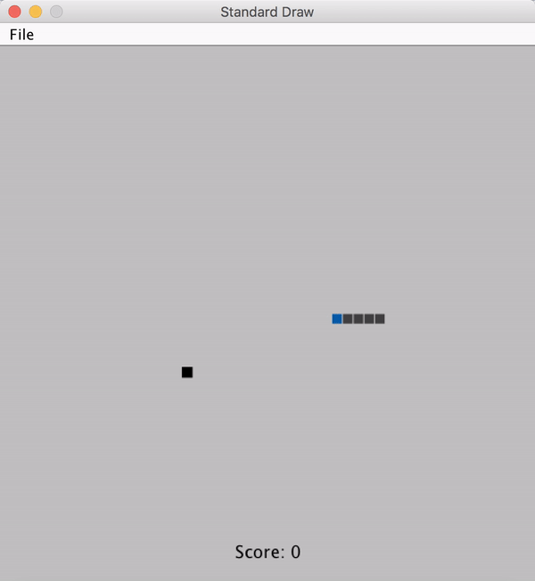

# Snake Game Autoplay

In this game... Well, snake game is so popular. I don't think I need to introduce the rules.

When it does not know what to do, it will ask for the player to help.

To compile and play, simply run the following commands:
```bash
> cd src
> javac -cp ".:../lib/stdlib.jar" *.java
> java -cp ".:../lib/stdlib.jar" Demo
```


